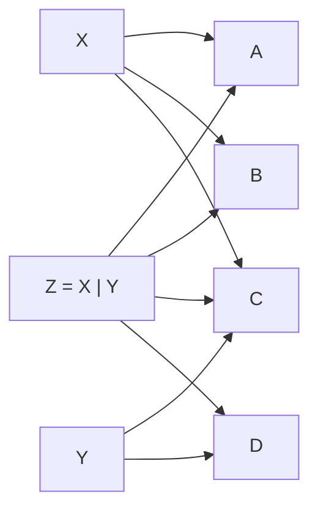

# Union Types

A value that may be "one of N possibilities" is given an **untagged union type**,
written by listing the member types separated by `|`:

```tel
type Shape = (Circle | Rectangle | Triangle)
```

## The variant's type is its tag

There is no separate tag, discriminant, or constructor wrapping a member. A value
of `(Circle | Rectangle | Triangle)` *is* a `Circle`, or *is* a `Rectangle`, or
*is* a `Triangle` — nothing is added around it. You recover which one it is by
matching on the **type**:

```tel
match shape {
    c: Circle    => c.radius * c.radius * pi,
    r: Rectangle => r.width * r.height,
    t: Triangle  => t.base * t.height / 2,
}
```

This differs from tagged/nominal enums (Rust, Swift, Haskell), where each variant
is a distinct constructor that exists only inside that one enum. In Tel the
members are ordinary, independent types that also exist on their own.

## Why untagged — and the pitfalls accepted

Untagged unions were not an obvious choice; tagged and untagged were both
weighed. The reasons untagged won:

- **The members are real, reusable types.** A `Circle` exists on its own, not
  only "inside `Shape`". This matters for data-transformation code and for the
  multi-host story: a host type maps to a Tel type without an artificial
  enum wrapper.
- **Useful subtyping falls out.** `Text` is assignable to `(Text | None)`, so a
  trait method returning `(Text | None)` can have an implementation that always
  returns `Text`, and a caller with the concrete type skips the absence check.
  Tagged enums cannot express this — `(A | B)` is not a subtype of `(A | B | C)`,
  and the variants are not types. See
  [`../05-types/09-subtyping-and-variance.md`](../05-types/09-subtyping-and-variance.md).
- **Set algebra is clean.** Flatten and deduplicate (below) make composing
  unions trivial and associative.

The honest costs, which Tel accepts and works around:

- **Members that share a representation collapse.** `(Float | Float)` is `Float`;
  you cannot have two same-typed cases without newtypes (see
  [Tagged unions, when you want them](#tagged-unions-when-you-want-them)).
- **`Option[Option[T]]` collapses** unless the present case is a wrapper type —
  see [Generics and the collapse problem](#generics-and-the-collapse-problem).
- **No per-variant methods for free.** A tagged enum can carry methods like
  `map_err` defined per variant; an untagged union gets methods only where all
  members agree (see [Shared fields and methods](#shared-fields-and-methods)) or
  via the wrapper types. This is a real ergonomic loss the design takes
  knowingly.

## Unions flatten and deduplicate

A union is just a *set of member types*, so composing unions is set union:

- **Flatten** — a union of unions has no nesting. Given `X = (A | B | C)` and
  `Y = (C | D)`, the type `(X | Y)` is exactly `(A | B | C | D)`.
- **Deduplicate** — a type that appears in more than one operand appears once in
  the result. The `C` reached via `X` and the `C` reached via `Y` are the
  **same** `C`. There is no "`C`-from-`X`" versus "`C`-from-`Y`" distinction, and
  a `match` has exactly one `C` arm covering both.

```tel
type X = (A | B | C)
type Y = (C | D)
type Z = (X | Y)      // == (A | B | C | D)
```



Consequences:

- `(A | A)` is just `A`; a union of one type is that type.
- Union is commutative and associative — `(X | Y)` and `(Y | X)` are the same type.
- Two unions are equal when they have the same set of members, regardless of how
  they were written or grouped.

## Members are concrete types

A union's members are concrete types. A trait does not appear as a member: a
trait is a type *bound*, not a type, so it constrains what a member may be
rather than being one itself. Members are therefore disjoint by construction —
every value has exactly one member type, and the matching arm is chosen without
ambiguity.

Restricting members to concrete types is also what keeps the members provably
**disjoint**. If a trait could be a member, a single value might satisfy two
members at once (`(IAdd | ISub)` with a type that is both), and `match` would have
no unambiguous arm. Concrete members sidestep that — and sidestep a known
theoretical hazard, that untagged unions over unrestricted members can make type
checking undecidable.

A **trait object** (`dyn Drawable`) *is* a concrete type — a single value with a
known representation (see
[traits](03-traits-or-interfaces.md#dynamic-dispatch-when-its-worth-the-indirection))
— so it can be a union member: `(Circle | Square | dyn Drawable)` is legal. What
is rejected is a **bare trait** member: `(Circle | Drawable)` is not allowed,
because for an *open* trait (the default) some concrete type
could satisfy `Drawable` *and* coincide with another member, reintroducing the
overlap concrete members exist to rule out. A trait object does not have this
problem — it is one specific erased type, not "anything implementing the trait".

This resolves the union-member-types question the
[philosophy chapter](../02-philosophy/04-antifeatures.md) carried as open:
members are concrete types (trait objects included), traits are bounds. Because
Tel is frozen, the restriction is permanent — loosening it would need a Tel2.

A **sealed/closed trait does not become a union member** either. The pull to
allow it — "its implementers are a known set, so it cannot overlap another
member" — is answered a different way: list the concrete members and put the
contract on the *union* as a bound, `(Circle | Square) : Drawable` (see
[Requiring a capability](#requiring-a-capability-with-a-member-bound) below).
Members stay concrete and disjoint; the trait stays a bound. This is the
unification in
[TIP-0002](../tips/0002-untagged-unions-and-sealed-traits.md): the union is the
one closed-set construct, so there is no separate sealed-trait construct to admit
as a member.

## Generics and the collapse problem

Untagged unions interact badly with generics. Consider a generic union:

```tel
type Either[A, B] = (A | B)
```

Instantiated as `Either[Int64, Int64]`, the members collapse: `(Int64 | Int64)` is just
`Int64`, and you cannot tell which side a value came from. The same effect makes
`Option[Option[T]]` collapse to `Option[T]` if `Option` is defined as a bare
`(T | None)`.

The fix is a **modelling habit, not a language feature**: wrap each side in its
own newtype or single-field record, so the wrappers act as tags.

```tel
struct Ok[T]  { value: T }
struct Err[E] { error: E }
type Result[T, E] = (Ok[T] | Err[E])   // Ok[Int64] and Err[Int64] stay distinct
```

Now `Ok[Int64]` and `Err[Int64]` are different types even though both wrap an `Int64`,
and `Result[Int64, Int64]` has two genuinely distinct cases. The wrapper structs
also give each variant a separately-addressable name — the thing tagged enums
provide for free. The cost: generic code defines a fair number of small wrapper
structs by hand. The design accepts this because the wrappers are cheap (see
[`../05-types/12-refined-types.md`](../05-types/12-refined-types.md)). The same
technique is what makes `Option[T]` safe to nest — see
[`../05-types/06-option-and-nullability.md`](../05-types/06-option-and-nullability.md)
and [`../05-types/07-generics.md`](../05-types/07-generics.md).

TODO(open): when is a union type like `(A | B)` checked / resolved? Open
whether it is monomorphised at the first function that takes the union (like a
sealed trait) or re-checked at each use (like a Rust enum). Decide and document;
it affects compile speed and error locality.

## Tagged unions, when you want them

Because the *type* is the tag, two members that share a representation cannot be
told apart — `(Float | Float)` is just `Float`. To get a traditional *tagged*
union, give each case its own newtype; the wrapper types then act as the tags:

```tel
type Celsius     = newtype Float
type Fahrenheit  = newtype Float
type Temperature = (Celsius | Fahrenheit)
```

An untagged union of named types otherwise behaves like a sealed type or a
closed interface — a fixed, fully known set of cases, matched exhaustively.

## Mutable unions: `!Union` and re-tagging

A union reuses the whole `!T` / freeze machinery
([TIP-0001](../tips/0001-mutability-and-borrowing.md), Accepted), with "mutate a
field" replaced by "swap the active variant." Its `Alias` rule is the exact
mirror of the [record rule](01-records.md#mut-fields-reassignable-slots) — two
axes, payload interior and re-tagging:

> A union is `Alias` iff **every variant payload is `Alias`-typed** *and* **the
> tag is final** (no in-place re-tagging).

In-place re-tagging is the union's structural root of affinity, the mirror of a
`mut` field: swapping the variant writes tag+payload into shared storage, so a
concurrent alias that read the old tag would mis-read the new payload
(type-confusion). Re-tagging therefore requires `&!` (exclusive) access, which a
re-taggable union cannot have while staying `Alias`. Two clean cases, no middle:

- **Re-tag not allowed (common):** the union is `Alias` iff all payloads are
  `Alias`. Switching variant is done by copy-update / rebind — binding-level,
  needing no mutable union type, so no second declaration.
- **Re-tag allowed (opt-in):** that *is* `!Union` — the in-place-swappable form,
  paired with frozen `Union` and the same auto `finish()`.

## Shared fields and methods

Because the members are real types, an untagged union automatically supports
anything *all* of its members support. If every member has a field of the same
name, position, and type, that field is accessible on the union directly — no
`match` needed:

```tel
type SchoolPerson = (Teacher | Student)
# Both Teacher and Student have `name: Text`:
fn label(p: SchoolPerson) -> Text { p.name }
```

This is the general rule: any field present with the same name and type in every
variant is always accessible. It is structural typing in spirit — the union
exposes the interface its members have in common — and it is how TypeScript-style
unions behave. See
[`../05-types/01-type-system-overview.md`](../05-types/01-type-system-overview.md)
for the nominal-vs-structural framing.

The same auto-exposure **extends to methods and trait impls**, not just fields:
any method or whole trait that *every* member implements is callable on the union,
dispatched to the member's own impl. A union's behaviour is thus the
*intersection* of its members' behaviour (see the
[nominal / structural / bound](../05-types/01-type-system-overview.md#nominal-structural-or-a-bound)
framing).

### Requiring a capability with a member bound

That auto-exposed surface is *discovered*, and so fragile: add a member lacking a
method and the union silently stops offering it, with the error surfacing far
from the cause. To make a capability a **guarantee**, give the union a trait
bound — a *capability floor* — written after it with `:`:

```tel
type Shape = (Circle | Square | Triangle) : Drawable
```

`: Drawable` requires **every member** to implement `Drawable`, checked at the
union declaration, so adding a non-`Drawable` member is a compile error *here*,
where the mistake is — not downstream. It is a **floor, not a ceiling**: the
union still auto-exposes everything else its members happen to share; the bound
only pins the part you promise to keep. Pin several with the
[trait-list](03-traits-or-interfaces.md#trait-lists-and-bound-aliases) grammar or
a bound alias — `(A | B) : Drawable + Hashable`, `(A | B) : Renderable`.

Behaviour the members do *not* individually provide is still possible: write an
explicit `impl Drawable for Shape { … match … }` on the union itself. The two
compose — `: Trait` forwards each member's own impl; an explicit `impl` gives the
whole union one match-based implementation.

This member bound is what makes a separate "sealed trait" construct unnecessary:
"a closed set whose members all support a contract" is exactly `(A | B) : Trait`
(see [TIP-0002](../tips/0002-untagged-unions-and-sealed-traits.md)).

TODO(open): `: Trait` on a `nonexhaustive` union must bind future members too —
confirm the rule and the error wording. And `impl Trait for` a (structural) union
raises orphan/coherence questions; see
[TIP-0005](../tips/0005-trait-coherence-and-the-orphan-rule.md).

## Exhaustive matching

`match` over a union must cover every member type; a non-exhaustive `match` is a
compile error. Exhaustiveness is what makes unions safe to reason over — adding a
member forces every `match` on that union to acknowledge it.

### Non-exhaustive unions — the opt-out

Exhaustiveness is the default, but it has a cost the design takes seriously:
**if every `match` must be exhaustive, adding a union member is always a breaking
change**. For a language frozen on stability, that is sometimes exactly wrong —
an error-code union or a host-extensible set of cases should be able to grow
without breaking every downstream script.

So a union may opt **out** of exhaustiveness — declared *non-exhaustive* (Rust's
`#[non_exhaustive]` is the reference point). A `match` on a non-exhaustive union
must then carry a catch-all arm, and adding a member does not break callers.

```tel
# A non-exhaustive error union: new errors can be added later.
nonexhaustive type ReadError = (NotFound | PermissionDenied | InvalidUnicode)

match err {
    NotFound         => "missing",
    PermissionDenied => "denied",
    _                => "other read error",   // catch-all required
}
```

This makes exhaustiveness a per-union, author-chosen trade-off:

- **Exhaustive (default)** — adding a member is a deliberate breaking change that
  forces every `match` to be revisited. Right for a closed domain model.
- **Non-exhaustive** — the union may grow compatibly. Right for error sets and
  host-extensible cases. The price is that callers always handle "something
  else".

See the exhaustive-matching note in
[`../02-philosophy/03-features.md`](../02-philosophy/03-features.md).

## Data-less variants and named-boolean enums

A union member may be a type with no fields — a *data-less* type. For such a
type the type and its single value are interchangeable (it behaves like the
[unit type](../05-types/02-primitive-types.md)): writing the name produces the
value, and matching on it needs no binding.

This gives Tel a clean replacement for bare booleans. Instead of a `Bool`
argument whose meaning is invisible at the call site, declare a two-variant
union of data-less types:

```tel
type Interpolation = (DoInterpolate | DoNotInterpolate)

fn render(template: Text, mode: Interpolation) -> Text { ... }

render(t, DoInterpolate)        // reads clearly; `render(t, true)` would not
```

This is the "named boolean" pattern: a two-variant data-less union *is* a domain
boolean, with self-documenting call sites and exhaustive matching. It is just
the ordinary union machinery — no special enum construct — applied to the
data-less case. There is also a want for the ability to *negate* such a value
— flipping it to the complementary variant. The spelling is the word **`not`**
(`not DoInterpolate` → `DoNotInterpolate`), the same logical-negation word used
for capability opt-out (`: not Send`); the `!` sigil is reserved for
unique/exclusive ownership and never means "not" (see
[Maxims](../02-philosophy/02-maxims.md)). Whether two-variant data-less unions
support `not` at all is open.

TODO(open): negation of a two-variant data-less union (`not Variant`), and whether a
data-less union can be *iterated* (list its variants) the way Java enums can —
that Java-enum capability is missing in Rust. Iterating variants needs some
reflection-like support, which Tel restricts; lean toward a `derive`-style
opt-in rather than built-in reflection.

TODO(open): giving an enum a defined *default* / zero value
("enums should have 0 as undefined default") for serialization compatibility.
This is a serialization/schema concern; defer to the data-modelling serialization
story.

## Inline / structural unit-type literals

One candidate is a lightweight syntax for one-off data-less types — `:NotFound` as
both a type and its sole value, usable inline in a union like
`ReadResult[T] = (T | :NotFound | :PermissionDenied)`. Two `:NotFound` written in
different places would refer to the same type.

TODO(open): adopt or reject inline `:Name` unit-type literals. They are
convenient for error unions, but they scale awkwardly to cases that carry data
(`:NotFound(Path)`), and an ad-hoc same-name-means-same-type rule is a subtle
new global namespace. Lean: prefer ordinary named data-less type declarations
for clarity (per "readability over writability"); revisit only if error-union
boilerplate proves painful.

TODO: review
