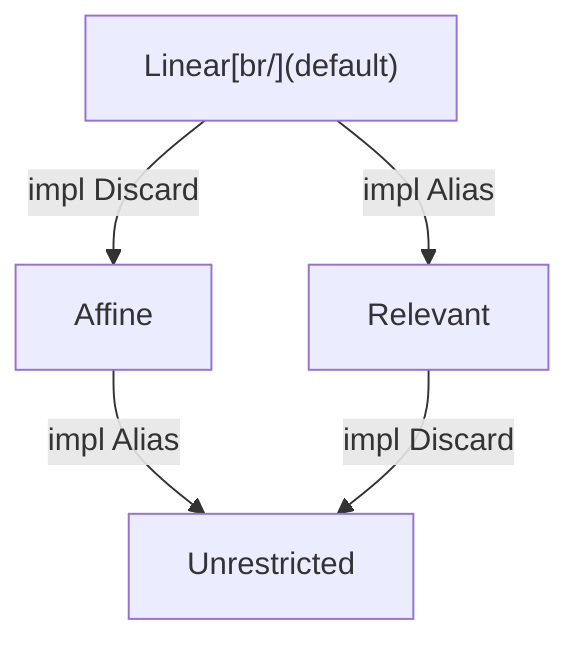

# Substructural Types: Affine and Relevant

Tel tracks two structural properties on every type that decide **how many
times a value may be reached** and **whether it may be thrown away unused**:

- **Affine** — at most one binding may reach a value at a time. Sharing by
  adding a second name is forbidden; the only way to "use" the value
  elsewhere is to *move* it (consuming the original binding).
- **Relevant** — a value *must* be used before it leaves scope. Silently
  dropping it is a compile error.

A type that is both is **linear**: used exactly once, never aliased. **Tel
makes every type linear by default.** A type relaxes each half by gaining a
capability — the two opt-out traits **`Alias`** (drop the affine restriction)
and **`Discard`** (drop the relevant restriction). Both are derived
structurally, the same way [`Send`](../14-concurrency-and-parallelism/09-scoped-values.md)
is computed from a type's fields, so the common data types carry both without
any annotation.

This is the "phrased in what they *can* do" framing: a type does not declare
*"I am affine"*; it either has the `Alias` capability or it does not.

## The four quadrants

| `Alias`? | `Discard`? | Result | Meaning | Example |
| --- | --- | --- | --- | --- |
| no | no | **Linear** | one owner, must be used | a mutable DB connection — one writer (no races) and must `close` (no leak) |
| no | yes | **Affine** | one owner, may drop | a mutable collection being built — one writer, but you can abandon it and let GC reclaim it |
| yes | no | **Relevant** | aliasable, must be used | an MPSC `Sender` — many may exist, but each must be released so the channel closes promptly |
| yes | yes | **Unrestricted** | copy and drop freely | immutable data — a `Person` record, the number `5` |

The bottom-right cell is what most languages give *every* value. Tel's
inversion is deliberate: the dangerous defaults (leak a handle, alias a
mutable value into a data race) are the ones you must *opt into* relaxing.



## Affine and the `Alias` capability

A value is **affine** iff *at most one binding may reach it at any moment*.
Assigning it to a second name **moves** it — the first binding becomes
inaccessible. There is never more than one owner. Borrows
(`&T`, `&!T`; see [References and Aliasing](04-references-and-aliasing.md))
are *not* second owners — they are time-bounded access that suspends the
owner for the borrow's scope, after which the owner is reinstated.

A type implements **`Alias`** to drop this restriction: its values may be
reached from several bindings at once. "Alias" does not mean the value is
literally copied — it means *more than one path may reach it*. A `Sender`
that internally holds a shared reference is `Alias`: handing it to two tasks
gives two handles onto one channel, no deep copy involved.

**Derivation.** The rule has *three* conditions:

> A type is **`Alias`** iff it is **not declared `!`**, **all of its fields are
> `Alias`-typed**, *and* **all of its fields are final (no `mut`)**.

A field contributes mutability along two independent axes, and both must be
clear for `Alias`:

- **Interior mutation** — calling the held value's mutating methods — is decided
  by the **field's type** (`!List` yes, `List` no). No annotation carries it;
  the type already does.
- **Reassignment** — repointing the slot at a different value — is **not** a
  property of the field's type. It is marked with **`mut` on the field** (the
  exact opposite of Java's `final`), and it is **shallow**: `mut the_xs: List`
  makes the *slot* repointable, not the `List` contents. The default (no `mut`)
  is final.

The finality half is easy to miss but essential: reassigning a `mut` field, like
calling any mutating method, requires `&!` (exclusive) access to the containing
value; granting `&!` needs the compiler to *prove* exclusivity, which is exactly
the uniqueness tracking an `Alias` type has given up. So a type with any `mut`
field can never soundly be `Alias` — having only `Alias`-*typed* fields is not
enough.

Affinity has two **structural** roots and one **declared** one. Structurally, a
type is affine (¬`Alias`) iff it transitively contains a `mut` field *or* a
field of an affine (`!`-typed) type — you cannot freely share a whole when a
part is unshareable. The primitive mutable cell is literally `record { mut
the_value: … }`, so an "interior-mutable type" (`!List`) bottoms out in the
`mut` root. On top of that, a type may be **declared affine directly** by
spelling it `!T` — an owned resource that need not contain any `mut` field (an
OS handle, a live socket). The `!` in its name *is* the affine spelling, and
bare `T` is its frozen `Alias` projection; see
[mutability](../06-bindings-and-scope/02-mutability.md#three-declaration-shapes).

```tel
# All fields final and Alias-typed → Point derives Alias, freely shared.
type Point = record { the_x: Int64, the_y: Int64 }

# A mut field makes the type affine → it must be named `!Counter`;
# bare `Counter` is its derived freeze.
type !Counter = record { mut the_n: Int64 }
fn bump(a self: &!Counter) { self.the_n = self.the_n + 1 }   # exclusive borrow of the affine type

# mut is shallow: the slot may be repointed, the List stays immutable.
type !Log = record { mut the_entries: List[Text] }   # affine; List contents not mutable
```

Worked through:

- Immutable, freely-shareable data (`Int64`, `Text`, `List`, records of final
  `Alias` fields) derives `Alias` automatically.
- The apparent exception — a stdlib concurrent map or a cloneable channel
  `Sender` that is mutable *and* `Alias` — is **not** a blessing carved into
  the trait system. It bottoms out on two different primitive cells: an
  ordinary **unique cell** (a `mut` field, so ¬`Alias`) and a **synchronised
  cell** (`Alias`, because its internal lock/atomic makes many paths safe). A
  `!List` built on the unique cell derives ¬`Alias`; a `ConcHashMap` built on
  the synchronised cell derives `Alias` — both purely by field derivation. User
  code cannot reach the synchronised cell only because the raw lock/atomic
  primitives are stdlib-only (an [antifeature](../02-philosophy/04-antifeatures.md)),
  not because of a `Mut`-style flag.
- A type may **opt out** of `Alias` explicitly even when its fields would
  allow it — e.g. a capability token you never want duplicated.

Borrow-storing view types are consistent with this rule: their fields are
**final** (no `mut`), so the only reason they are not `Alias` is the borrow they
store, tracked by lifetime propagation — not a reassignable slot.

`mut` is spelled `mut`, not `uniq`, on purpose. `uniq` on a *binding* means
"this local is rebindable *and* I hold exclusive access"; `mut` on a *field*
means only "this slot is reassignable" — a structural layout fact, Java's
non-`final`. They answer different questions, so they get different keywords.

### Requiring `Alias` (and other capabilities) on a type

`Alias` is auto-derived, but an author who intends a type to stay freely
shareable can **require** it, so the compiler errors if a later edit accidentally
breaks it (adds a `mut` field or a non-`Alias` field). The spelling is a
**declared capability bound on the type** — the same capability-floor surface
that [TIP-0002](../tips/0002-untagged-unions-and-sealed-traits.md) gives unions
(`(A | B) : Trait`):

```tel
type Person : Alias = record { ... }   # asserts Alias; compiler checks the derivation still yields it
```

It is a pure compile-time assertion on a derived property — no runtime cost, no
test scaffolding. (The rejected alternative, a standalone static check, would
need a compile-time-value mechanism Tel does not have.) The same `: Capability`
spelling generalises to asserting `Discard` / `Send` / `Sync`.

### Recursive types: derivation is coinductive

A recursive type feeds its own capability question back into itself:

```tel
type Node = record { the_next: Option[Node], the_value: Int64 }
```

Does `Node` derive `Alias`? By the field rule that depends on `Option[Node]`,
which depends on `Node` — a cycle. The rule Tel commits to: **assume the
capability holds for every type in the cycle, then look for a field that
refutes it.** A capability fails only on concrete refuting evidence — a `mut`
field, a field whose out-of-cycle type lacks the capability, or an explicit
opt-out. The cycle itself never counts against it, so `Node` above derives
`Alias`.

Why assume-then-refute and not the other direction: requiring every field to
have *already* derived the capability would make every recursive type fail
every capability — `Node` could never derive `Alias`, because deriving it
would need `the_next` to have derived it first. The assume-then-refute
(*coinductive*) reading gives the answer a reader expects, and it has exactly
one deterministic result: the compiler resolves each cluster of mutually
referencing type definitions as one unit, so the outcome never depends on
which member it happened to examine first. (Rust's auto-traits — `Send`,
`Sync` — use the same coinductive rule.)

This applies uniformly to every structurally-derived capability on this page —
`Alias`, `Discard`, `Send`, `Sync`, `Unpack`, and relevance through union
members alike.

Because aliasing an `Alias` value is just binding it to another name, there
is **no `.clone()`** for it — duplication is implicit and free. A deep,
independent copy is a *different*, explicitly-named operation, never spelled
the same way as taking another reference (forking a handle and snapshotting
its contents must not look alike).

### "Mutable" is a concept, not a trait

There is **no `Mut` trait** (and no `Immutable` trait). Mutability is not a
capability the type system tracks; it decomposes into two things already
present:

- **Field mutability feeds `Alias` derivation.** Mutability is a property of a
  **field** — data is what changes. A field is declared mutable or immutable;
  a *type* is "mutable" iff it has a mutable field. Since a mutable field is
  ¬`Alias` (above), the `Alias = all-fields-Alias` rule already does all the
  work. Methods do not enter into it: a method is a trait impl, not part of the
  type's data, so "has mutating methods" is a *consequence* of having a mutable
  field, never the definition.
- **Per-method self-access gates mutation.** A mutating method declares the
  access it needs: the normal case requires `&!Self` (exclusive); the
  synchronised case (`ConcHashMap.insert`) requires only shared `&self` and
  relies on its internal lock. You can never obtain `&!` of an `Alias` value,
  so an `Alias` value's `&!`-requiring methods are simply uncallable —
  effectively immutable-through-sharing, again with no rule stating it.

**`ConcHashMap` is mutable *and* `Alias`** — the two are orthogonal. *Mutable*
describes its fields (it changes); *`Alias`* describes reachability (many paths
may reach it, safely, because the change is synchronised). The dangerous corner
— mutable + `Alias` + unsynchronised — is unreachable by construction, not
forbidden by a rule.

**Whether you need `uniq` is decided by `Alias`, not by mutability.** Among
types that mutate: a ¬`Alias` mutable type (`!List`) needs a `&!Self`
to mutate; an `Alias` mutable type (`ConcHashMap`) cannot obtain `&!` at all
and mutates through synchronised shared access instead. So `Alias` alone tells
you the `uniq` story; a `Mut`/`Immutable` trait would add no information. If a
genuine need to *bound on immutability* ever appears (the likeliest is map-key
/ hash stability), it should be spelled **`Immutable`** as a positive
capability — never `Mut` — and only after the `Hash`/`Eq` contract is shown
insufficient. `TODO(open): revisit only if a real immutability-bound use case
arises.`

## Relevant and the `Discard` capability

A value is **relevant** iff it *must be used* before its binding goes out of
scope. Letting it fall out of scope unused is a compile error. This is the
guarantee that turns "you forgot to close it / commit it / await it" from a
runtime bug into a non-compiling program.

### What "use" means

A relevant type has a **private destructor**: ordinary code cannot destroy an
instance. The author instead exposes **one or more consuming "use" methods**
— `close()`, `commit()`, `rollback()`, `finish()`, `await()` — each of which
takes ownership and finalises the value. Calling one is the *use*.

The consequence is structural: if a relevant type exposes **no** use method,
no code that constructs it can ever compile (the value can be neither dropped
nor consumed), so an author who makes a type relevant is *forced* to give it
a way to be settled. There is exactly one way to retire the value, and the
author named it.

```tel
type Txn = relevant record { the_handle: DbHandle }   # no Discard

# author must provide consuming methods, or Txn is unusable:
fn commit(a self: Txn) -> () { ... }      # consumes self
fn rollback(a self: Txn) -> () { ... }    # consumes self

fn transfer(a db: &!Db) {
    let my_txn = db.begin()
    my_txn.debit(100)
    # forgetting `my_txn` here is a COMPILE ERROR: it is relevant and unused
    my_txn.commit()                       # the use; my_txn consumed
}
```

### `AutoUse` — relevance without ceremony

Requiring an explicit `commit()`/`close()` everywhere is correct but verbose
for values that have an obvious end-of-scope action. A relevant type may
implement **`AutoUse`** (name TODO) to declare *how* it should be used if the
program reaches the end of its scope without using it explicitly. When the
compiler can **prove where the value's life ends** — it is not aliased and
not stashed into something whose lifetime it cannot follow — it inserts the
`AutoUse` action automatically.

The value is **still relevant**: the guarantee ("this is used exactly once")
holds. `AutoUse` only removes the keystroke when the drop point is statically
known. Where the compiler cannot prove the drop point, the explicit use is
required again — there is no silent leak.

```tel
type File = relevant record { ... }
impl AutoUse for File { fn use(a self: File) { self.close() } }

fn read_config(a path: Text) -> Text {
    let my_file = File.open(path)
    let my_text = my_file.read_all()
    my_text                               # my_file.close() inserted here automatically
}
```

This is RAII-shaped, but it is **opt-in and visible in the type**: a value is
auto-closed only if it is relevant *and* its author wrote an `AutoUse`. There
is no hidden destructor on arbitrary types.

**`AutoUse` actions are NoPanic and return nothing relevant.** Because an
`AutoUse` action can run on the [cleanup
unwind](../13-error-handling/04-panics-and-aborts.md#cleanup-and-the-abort-path)
of an aborting task — where there is no caller to hand a result to and no panic
may occur — it must be **NoPanic**, and its return type must be `Discard`
(typically `()`). Returning a relevant value would create an un-settled must-use
value *on the unwind path*, i.e. the very leak `AutoUse` exists to prevent. An
**explicitly called** consuming method has neither restriction: `commit()` may
return a `Result` you handle on the spot, and may itself panic like any
normal-path code. The NoPanic-and-non-relevant-return rule binds only the settle
action the unwind runs unattended.

### Derivation

A type is `Discard` iff **all of its fields are `Discard`**, and may opt out.
Plain data is `Discard` automatically; a record that stores a `Txn` or a
`File` is **not** `Discard` (it inherits the must-use obligation), so the
relevance propagates upward exactly like the borrow and `Send` properties.

### Unions derive relevance as the *meet* of their members

A union has no properties of its own — it is just the union of its members
([union types](../10-data-modelling/02-union-types.md)) — so it carries a
capability iff **every** member does:

> A union is `Discard` iff **all** of its members are `Discard`. Equivalently,
> it is **relevant if any member is relevant**.

This is forced by soundness, not convenience. A value of `(A | B)` is *either*
an `A` or a `B`, and the compiler cannot know which, so it may be dropped only
when dropping *either* possibility is allowed. The same meet rule governs every
other axis: a union is `Alias` / `Send` / `Sync` iff all of its members are.
The opposite rule (`Discard` if *any* member is) would be unsound — it would
let a relevant `Err[File]` be widened to a `Result[T, File]` and then silently
dropped.

### Why every `Result` is relevant

The meet rule on its own does **not** make `Result[T, E]` must-use: with plain
payloads (`Result[Int64, ParseError]`) both members are `Discard`, so the union
would be `Discard` too. The must-check-your-errors guarantee therefore does not
come from `Result` — it comes from **`Err[E]` being declared relevant
regardless of `E`**:

```tel
type Ok[T]  = record { value: T }              # Discard iff T is
type Err[E] = relevant record { error: E }     # relevant for every E
type Result[T, E] = (Ok[T] | Err[E])
```

`Err` is a [wrapper struct](../10-data-modelling/04-generic-data-types.md#wrapper-structs-as-tags),
so opting *it* out of `Discard` is enough: every `Result` then has a relevant
member, and by the meet rule *every* `Result` is relevant — even
`Result[Int64, Int64]`. The property lives on `Err`, where "a failure exists"
is the thing that must not be ignored, not on `Result`, which keeps unions free
of properties of their own. This is the source of the must-use guarantee that
[Error Propagation](../13-error-handling/03-error-propagation.md) relies on; the
same shape makes an un-awaited task handle a compile error.

### Destructuring discharges the obligation onto the parts

Matching or destructuring a relevant value **is** a use: it consumes the
wrapper and moves any remaining obligation onto the bound parts.

```tel
match result {
    Ok(v)  -> use(v),
    Err(e) -> log(e),     # the `Err` arm is the use; its relevance discharged here
}
```

Writing the `Err` arm is exactly how the obligation is met — you have *engaged*
with the failure. Once the `Err` wrapper is destructured, the payload `e: E`
carries only `E`'s own obligation: if `E` is plain data it may be dropped
(`Err(_)` is fine), but if `E` is itself relevant (`Err[File]`) then `Err(_)`
would drop a relevant `File` and does not compile.

This makes a subtle pair of spellings behave very differently — the distinction
is **what `_` is applied to**:

```tel
let _ = some_result           # ✗ `_` matches the WHOLE Result and drops it —
                              #   the Result is relevant, so this does not compile

match some_result {           # ✓ destructuring the union (all arms) settles the Result
    Ok(v)  -> use(v),
    Err(_) -> {},             #   the `Err` WRAPPER is consumed (the use); `_` drops only
}                             #   the payload — ok iff E: Discard, error if E is relevant
```

A bare `_` on the whole value *drops* it rather than moving it onward, so it
never discharges relevance. `Err(_)` is different: it destructures the wrapper
(the use) and applies `_` only to the inner payload, which is governed by `E`'s
own `Discard`-ness. (`let Err(_) = some_result` cannot stand alone — it is
refutable, since `some_result` might be `Ok` — so this only appears inside a
`match`/`if let` that also covers `Ok`.) The sanctioned "yes, I really mean to
drop the whole thing" spelling is the named explicit-discard construct, never a
top-level `_` (see
[Error Propagation](../13-error-handling/03-error-propagation.md)).

### `Unpack` — publishing destructuring as the public "use"

Inside a type's own module destructuring is **always available** — the author
can see every field, so taking a value apart is ordinary code, and for a
relevant value it is the privileged teardown (the same "private destructor" a
named `close`/`commit` method runs internally). The only question is whether
that ability is **published to outside code**, and that is the **`Unpack`**
capability:

`Unpack` is **derived structurally, like every other capability** — a type is
`Unpack` iff all of its fields (or, for a union, all of its members) are
`Unpack`, the same all-fields fold as `Discard`/`Send`/`Sync`. It is *not* a
special rule "keyed to `Discard`"; the correlation with `Discard` is arranged at
the **leaves**:

- **Plain (`Discard`) primitives are `Unpack`,** so any all-data type derives
  `Unpack` for free, exactly as it derives `Discard`.
- **Resource leaves are `not Unpack`.** The host/FFI roots that make a value a
  must-settle resource — a socket, a file handle — are marked `not Unpack` in the
  stdlib (just as they are `not Send`), so `Db`, `Txn`, and `File` are `not Unpack`
  and cannot be retired by unpacking; they keep their consuming methods as the
  only exit, because settling them runs real work (`COMMIT`, a socket shutdown)
  that moving fields out cannot perform.
- **Must-acknowledge wrappers opt back in.** `Err` is relevant yet **`Unpack`**,
  so `match`-ing it *is* the use; by the meet rule that makes `Result` `Unpack`
  (since `Ok` is too) even though it is relevant.

So `Unpack` ends up *correlated* with `Discard` without being identical: `Err`
is `not Discard` yet `Unpack`, and a sealed value type is `Discard` yet `not Unpack`.

Implementing `Unpack` is simply **exposing destructuring as the "use"** a type
would otherwise publish through a named consuming method: rather than writing
`fn into_parts(a self) -> (...)`, the author lets callers write `let T { .. } =
value` directly. It is a **pure permission with no body** — it never runs code;
anything that must *happen* on teardown stays in a consuming method or in
[`AutoUse`](#autouse--relevance-without-ceremony), which keeps `Unpack` from
becoming a hidden destructor. A `Discard` value you never want unpacked opts out
at the type level with the bound **`: not Unpack`** — the same `not Cap` spelling
used to opt out of `Send` / `Alias`, and the negation of the `: Unpack`
assertion.

Field [visibility](../11-modules-and-packages/03-visibility.md) is an orthogonal
floor on top of this: `Unpack` sanctions the *operation*, but a pattern can only
bind fields it can *name*, so even an `Unpack` type exposes unpacking only of
the fields visible at the use site.

### Cleanup on abort: a limited unwind, but no recovery

Relevance is first a **compile-time obligation on normal control flow**: on the
normal path the compiler proves every relevant value is used (or `AutoUse`d), a
static check that costs nothing at runtime. The harder question is what happens
on **abort**.

The tempting answer — "abort drops the whole task heap, so nothing needs cleaning
up" — is **not sound for a linear type system**. If a panicking task simply
discarded its heap, you could dispose of *any* linear resource by moving it into
a task and panicking it (a **task bomb**), defeating the must-settle guarantee
the type exists to give. So Tel *does* run cleanup on abort — but a strictly
limited kind:

- **A cleanup-only unwind settles live linear resources on the abort path.** As
  the task tears down, each live relevant resource is settled — it runs its
  [`AutoUse`](#autouse--relevance-without-ceremony) action, or the `finally` that
  covers it (see [panics and
  aborts](../13-error-handling/04-panics-and-aborts.md#cleanup-and-the-abort-path)).
  Pure in-heap values (plain data, affine builders) need no per-value action and
  are still reclaimed in bulk.
- **The unwind augments teardown; it never recovers.** It cannot catch the panic
  or resume past it — the task still dies at a task/fiber boundary. Everything it
  runs (`AutoUse` actions, `finally` blocks) is **NoPanic**, so the unwind itself
  cannot panic, and there is no "what if this call throws?" mid-expression
  reasoning (see [why abort, not
  recovery](../13-error-handling/04-panics-and-aborts.md#why-abort-and-not-unwinding)).
- **A strict relevant resource needs a settle action to exist.** A type whose
  settle requires a choice (`commit` vs `rollback`) has no action the unwind can
  run for it automatically, so it may not be left live across a `panics`-effect
  call: cover it with a `finally`, or keep it in a **no-panic region**. A relevant
  type that *does* provide an `AutoUse` needs neither.

So relevance is stronger than pure must-use: it is **must-use on the normal path,
and guaranteed-settle on the abort path**. The cost this reintroduces is a
*limited* one — a NoPanic cleanup unwind, with no recovery machinery and none of
the poisoned-lock / failed-join ceremony a recovering unwind brings — which is
exactly the narrow slice of "clean up on the failure path" a linear type system
genuinely requires, and no more.

### Prior art

- **Vale** ("Higher RAII") is the closest match. A linear struct must
  eventually be destroyed *explicitly*; `drop` is only the **default** if the
  author implements it, otherwise the user is forced to call one of the
  approved destructors — and those destructors may be **multiple, named, take
  parameters, and return values**. This maps almost one-to-one onto Tel:
  Tel's named "use" methods (`commit`/`rollback`/`close`) are Vale's named
  destructors, and Tel's `AutoUse` is Vale's optional default `drop`.
- **Austral** has true linear types with an explicit consume rule and no
  implicit destructors at all — same "private destructor + named use" core,
  but with no RAII default; Tel's `AutoUse` is the addition.
- **Rust** has affine values and `Drop`, but no *relevant* types: `#[must_use]`
  is a lint, not a type property, and `Drop` runs on every path (including
  unwinding). Tel makes must-use a real type property. Tel still settles linear
  resources on the failure path, but through a **NoPanic, non-recovering**
  cleanup unwind rather than Rust's recover-capable unwinding — so it keeps the
  must-settle guarantee even under a task bomb while avoiding the poisoned-lock /
  failed-join / "correct even if this call throws" reasoning.
- **Swift** (`~Copyable` types) gives affine values with a `deinit`, but its
  cleanup is implicit RAII with **no enforced must-use**, and it unwinds — the
  same two contrasts as Rust.

Tel's distinctive combination is Vale-style higher-RAII *with* affine and
relevant split into two independently-derived capabilities (`Alias` /
`Discard`) *and* abort-without-recovery: the must-use obligation is a
compile-time check on the normal path, backed by a NoPanic, non-recovering
cleanup unwind that settles linear resources on the abort path — so a task bomb
cannot leak them.

> TODO(open): `AutoUse` is a placeholder name. It must not be confused with a
> universal destructor — it only applies to relevant types and only when the
> drop point is statically provable.

## Capabilities of generic types

A generic type needs no special machinery: a type parameter `T` is, after
instantiation, just the type of whatever field stores it, so a `Thing[T]` that
holds a `T` inherits `T`'s capabilities through the ordinary all-fields rule —
**per instantiation**. `Thing[File]` is relevant; `Thing[Money]` is
unrestricted. No annotation, and no "relevant if `T` is relevant" clause to
write — it falls out of field derivation exactly as for `Send`.

Two points are easy to get wrong:

- **Propagation is per-axis, not one "linear" bit.** `Alias` and `Discard`
  derive independently. If `T` is affine but `Discard` (a `!List` builder),
  `Thing[T]` is affine-but-discardable; only a `T` that lacks *both* (a `File`)
  makes `Thing[T]` fully linear. "`Thing[T]` is as substructural as `T`" holds
  on each axis separately.
- **Phantom parameters do not propagate.** Capabilities flow only through
  *stored fields*. If `T` appears in the signature but is never stored — a
  phantom tag like [`Id[T]`](../19-use-cases/09-entity-identity-and-projections.md)
  — there is no field to carry the capability, so `Id[File]` is `Discard`.
  That is correct (no `File` is held), but it is the one case where "relevant if
  `T` is relevant" does not apply.

A generic type's *own* fields still count: a `Thing[T]` that also stores a
`File` is relevant for every `T`. To **require** a capability of a parameter,
put the bound on the method that needs it rather than the type
([generic data types](../10-data-modelling/04-generic-data-types.md#bounds-on-the-parameters)):

```tel
impl[T] Thing[T] {
    fn into_pool(a self) where T: Discard { ... }   # only when T may be dropped
}
```

## Composing the axes — useful combinations

Affine (¬`Alias`), relevant (¬`Discard`), `Send`, and `Sync` are **independent,
structurally-derived axes**, so a value can be any combination of them. Not every
combination is common, but each useful one names a real kind of value. The table
gives a concrete example for each combination worth knowing — *affine* means
**not** `Alias`, *relevant* means **not** `Discard`:

| affine | relevant | `Send` | `Sync` | A useful value of this shape |
| --- | --- | --- | --- | --- |
| no | no | yes | yes | **plain immutable data** — `Int64`, `Text`, a `Person` record. Alias, drop, send, and share across tasks, all freely. The everyday default-for-data. |
| no | no | yes | yes\* | **a stdlib concurrent type** — a `Mutex`, an atomic, a concurrent map. Mutable yet `Alias`+`Sync` through interior synchronisation: one shared object, many tasks. (\*the *only* mutable values that are `Sync`.) |
| no | yes | yes | no | **an MPSC `Sender`** — `Alias` (many handles may exist) but **relevant**, so each is released and the channel closes promptly; sendable to the task that will use it. |
| no | no | no | no | **an in-task shared handle** — a value aliasing a `not Send` host resource (a thread-local cache, a non-thread-safe FFI handle). Freely aliased and dropped *within* one task, never across one. |
| yes | no | yes | no | **a mutable builder / buffer** — a `!List`. One writer (affine, so no aliasing into a race), droppable (abandon it; GC reclaims), and movable to another task to build there. Not `Sync`: a mutable value cannot be shared. |
| yes | yes | yes | no | **a linear resource that can change hands** — a `File`, `DbConnection`, or `Txn`. Exactly one owner, *must* be `close`/`commit`-ed, and may be **moved** to another task, which inherits the use obligation. |
| yes | yes | no | no | **a task-pinned linear resource** — a GUI window handle, a GL context, a thread-local host handle. Unique and must-release like the row above, but `not Send`: it can never leave its origin task. |

A few corners are deliberately empty:

- **`Sync` requires `Alias`.** Sharing a value by reference across tasks *is*
  aliasing it, so an affine (¬`Alias`) value is never `Sync` — every affine row
  above is `Sync = no`.
- **`Sync` without `Send`** is exotic — a value whose read-only views are safe to
  share across tasks but which itself cannot move. Tel has no core example;
  flagged here rather than invented. `TODO(open): confirm no core type needs it.`
- A **borrow** of an affine value is `not Send` even when the owner is `Send`, since
  the borrow must not outlive the owner's task — except inside a
  [scoped task](../14-concurrency-and-parallelism/04-structured-concurrency.md#borrowing-in-a-scoped-task).
  A **relevant** value carries its must-use obligation across a boundary to the
  receiving task.

A **closure** is just an anonymous record of its captures, so it sits in this
same table by the standard field derivation — no closure-specific traits. The
*only* extra axis is **call multiplicity**, which is the affine/relevant lattice
re-applied to the call rather than the binding: `FnOnce` is affine-on-calls
(consuming an affine capture), and a closure over a **relevant** capture is itself
`¬Discard` (must-call). See
[Function Types](../05-types/05-function-types.md#function-value-flavours).

TODO(open): state the closure ⇄ substructural mapping in one place — captures
drive `Alias`/`Discard`/`Send`/`Sync`; the call adds the affine/relevant
multiplicity axis (`Fn` / `FnOnce` / must-call). Decide whether it lives here or
in [Function Types](../05-types/05-function-types.md).

### Where `Copy` fits

A fifth property is sometimes named — **`Copy`**, "duplicated by an independent
value-copy." In Tel it is **not a separate user-visible capability**. For the
only values that could have it (immutable, `Alias` data) aliasing and copying are
*unobservable*: a script cannot tell a shared reference from an independent
duplicate, because immutable identity is not observable (see
[the concurrency memory model](../14-concurrency-and-parallelism/07-memory-model-for-concurrency.md#identity-is-not-observable-on-values)).
So "copy vs alias" is a **representation** choice the backend makes — pass a small
`Int64` by value, a large record by shared reference — never a property a script
declares or observes. It folds into `Alias`; there is no separate `Copy` trait to
derive.

The same unobservable-identity fact makes the [linear iterator](#the-iterator-value-as-a-linear-resource)
free. A combinator threads its tail by reconstructing itself — `More(x,
Map{ src: rest, .. })` — and because identity is not observable, that
"reconstruction" moves and copies nothing at runtime: the backend reuses the
same storage and mutates in place. A consuming `next(self) -> Step[T]` and a
fused `next(&!self) -> Option[T]` compile to **identical** machine code
(mutate-in-place plus a branch). The only difference is type-level — one forbids
the call-after-end, the other does not — so the stronger single-poll guarantee
costs nothing.

See [Shared State and Locks](../14-concurrency-and-parallelism/09-scoped-values.md)
for `Send`/`Sync`.

## Iterating affine vs non-affine sources

The two axes explain why iteration sometimes needs a lifetime and sometimes
does not — **without** there being two kinds of iterator:

- Iterating an **`Alias`** collection (e.g. an immutable `List`) needs no
  borrow: the iterator just holds another alias of the source, kept alive by
  refcount/GC. No lifetime appears.
- Iterating an **affine** collection (e.g. a `!List`) cannot hold a
  second owner, so the iterator holds a `&T` **borrow** of the
  source, and a lifetime tracks that borrow.

It is one iterator design; the borrow-and-lifetime machinery simply does not
engage when the source is `Alias`. The non-affine case is the simpler special
case of the general borrowing one. See [Lifetimes](05-lifetimes.md).

### The iterator value as a linear resource

Source affinity — the axis above — decides whether the iterator *borrows*.
A **separate** axis is whether the iterator *value itself* is a linear
resource: one that must not be polled after it is exhausted. That is the right
contract for a resource-backed source — a channel receiver, a read-to-EOF
cursor, a poll-to-`Ready` future — where re-polling a finished source is a bug
worth catching rather than a `None`-forever no-op.

Tel expresses it with **no new syntax**. The iterator's `next` *consumes*
`self` and threads the continuation back through the return value; the terminal
variant carries no iterator:

```tel
type Step[T] = More(T, Iter[T]) | Done      # `Done` carries no Iter[T]

fn next(a self: Iter[T]) -> Step[T]          # CONSUMES self
```

Because `Done` carries no iterator, once iteration ends there is nothing in
scope to call again — "you cannot poll a dead source" is a plain
use-after-move error, not a convention. A borrowing `next(&!self)` cannot do
this: a `&!` borrow reinstates the owner *unconditionally* at the end of its
scope (see [References and Aliasing](04-references-and-aliasing.md)), so it
always leaves a live, re-callable iterator behind — which is exactly the fused
`next() -> Option[T]` shape. Owning-and-threading is the only way to reach the
dead end. The [iterators chapter](../10-data-modelling/10-iterators-and-sequences.md)
covers the surface model; [`for`](../08-control-flow/04-for-loops-and-iteration.md)
hides the re-threading so end users never write it.

**Early exit settles a linear iterator.** A `break` / `return` / `?` out of a
loop over a linear source leaves the reinstated `it` — a live `Iter` binding —
in scope. If that iterator is **relevant** (¬`Discard`, a must-settle
resource), it is a must-use binding: dropping it silently is a compile error,
so the author drains or settles the tail. This is not iterator-specific
machinery — it is the ordinary relevant-binding rule from this chapter. An
**affine** (`Discard`) source is instead abandoned to GC like any other
droppable value.

## See also

- [Lifetimes](05-lifetimes.md) — the borrow scopes that the affine half makes
  necessary.
- [References and Aliasing](04-references-and-aliasing.md) — `&T` /
  `&!T`.
- [Function Types](../05-types/05-function-types.md) — how affine and relevant
  captures shape `Fn` vs `FnOnce`.
- [Error Propagation](../13-error-handling/03-error-propagation.md) — `Result`
  is relevant, so it cannot be silently dropped.
- [TIP-0001](../tips/0001-mutability-and-borrowing.md) — the originating
  proposal.
