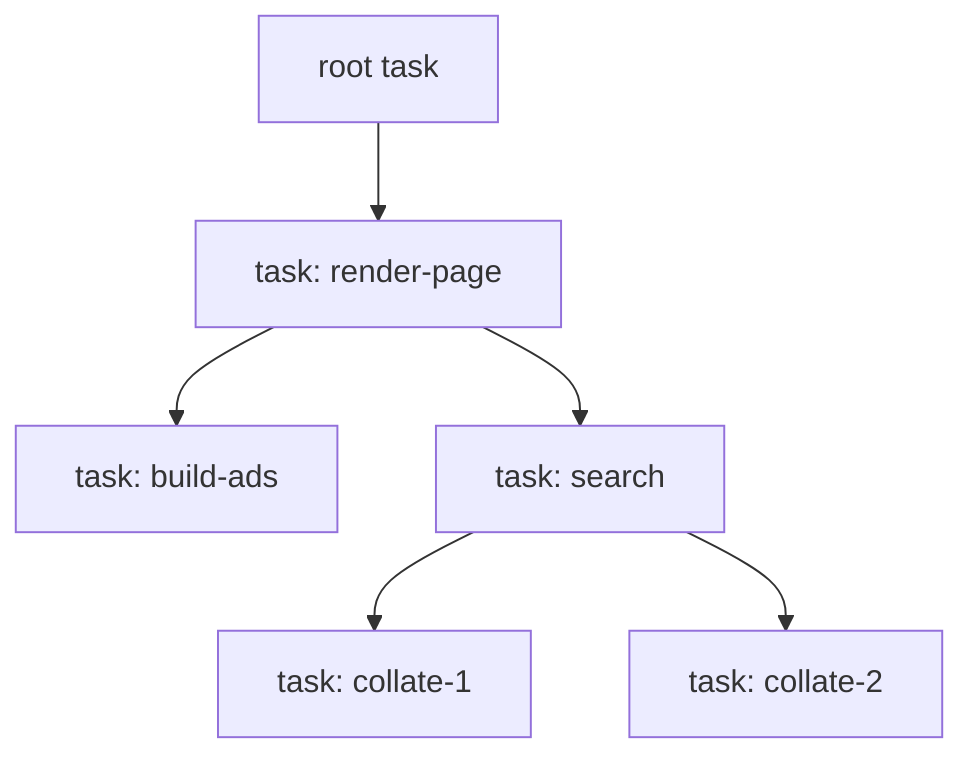

# Structured Concurrency

<!-- TODO: review -->

Tasks in Tel form a **tree**, not a loose set. A task that spawns another
becomes its *parent*; the spawned task is a *child*. This hierarchy is what
makes concurrent Tel code predictable: a task's children cannot outlive it,
errors are not lost, and a cancelled subtree is cleaned up wholesale.

This topic covers the lifetime rules, error propagation, and the Erlang-style
isolation that keeps one failed task from taking down the whole script.

## The task tree

Every task except the root has exactly one parent — the task whose body called
`spawn`. The invariant:

> A child task never outlives its parent.

When a parent finishes — normally, by failure, or by cancellation — the runtime
ensures every child is finished first. A parent that reaches the end of its
body waits for outstanding children; a parent that is cancelled cancels its
children first. There is no way to spawn a "detached" task that floats free of
the tree, and no daemon mode. This is the
[Java structured-concurrency](https://openjdk.org/jeps/453) shape: a scope of
tasks that opens and closes as a unit.



Cancelling `render-page` cancels `build-ads`, `search`, and transitively the
two `collate` tasks. `render-page` does not complete until all four have
stopped.

## Why a tree

- **No leaks.** A loose `spawn` that nobody joins is a resource leak and a
  source of "why is this still running" bugs. A tree has a defined close point.
- **Cancellation actually works.** Cancelling one node cancels its whole
  subtree; you never have to hunt down stray descendants by hand. See
  [cancellation and timeouts](08-cancellation-and-timeouts.md).
- **Errors have somewhere to go.** A child failure propagates *up* to the
  parent — there is always a parent to receive it.
- It matches [the maxims](../02-philosophy/02-maxims.md): *crash by default;
  recover at the boundary, not in the middle of the work* — the task tree
  defines exactly where those boundaries are.

## Error propagation

Errors are **not forgettable**. When a child task fails:

1. The failure propagates to the parent — by default, automatically. The
   parent does not have to remember to check.
2. The parent cancels its other children (their results are no longer needed)
   and then itself fails, propagating further up — unless it explicitly handles
   the failure at this boundary.

So an unhandled failure anywhere in a subtree unwinds that whole subtree and
surfaces at the nearest ancestor that chooses to handle it. This is the
concurrent form of Tel's [error handling](../13-error-handling/) story:
ordinary failures are values, propagated explicitly along the call chain;
*task* failures are propagated along the task tree, and the propagation is the
default rather than something you opt into.

Two failure flavours, and how they relate:

- An **ordinary error** produced by a task body is just the task's `Result`
  value — the joiner receives `Err(...)` and decides what to do. This is
  normal, expected control flow (a request rejected, a file missing).
- A **panic** — a truly unexpected condition (a violated invariant, a failed
  assertion) — also stops the task, but signals a bug rather than a handled
  outcome. Tel does not have exceptions and does not unwind across the whole
  program (see [antifeatures](../02-philosophy/04-antifeatures.md)); instead a
  panic is *confined to the task*. See the next section.

## Fibers fail in isolation

A task that **panics does not terminate the program.** It terminates *that
task*. The panic is captured and delivered to whoever joins the task — it
surfaces as a failed `join`, never as a process-wide abort.

This is the Erlang model: a task (fiber) is like a lightweight process with its
own [isolated heap](07-memory-model-for-concurrency.md). When it dies, the
runtime can drop the whole heap at once — no half-updated shared state to clean
up, because there was no shared mutable state to begin with.

Why this is the right balance:

- **Crash-by-default is kept.** The default reaction to a panic is still to
  stop work loudly — the task dies and its parent learns about it.
- **But recovery has a defined boundary.** A web server can fail one request, a
  test runner can fail one test, a pipeline can fail one message — without
  bringing down the host. The task tree *is* the recovery boundary.
- **No "what if it unwinds" tax.** Because a panic cannot unwind through
  arbitrary code, ordinary functions do not have to be written panic-safe. The
  runtime simply discards the failed task's heap.

```tel
# Run each request as a child task. One failing request fails
# only its own task; the server keeps serving.
fn serve(reqs: Channel[Request], tasks: Tasks, log: Log) {
    for req in reqs {
        let h = tasks.spawn("request", || handle(req))
        match h.join() {
            Ok(resp)  => send(resp),
            Err(fail) => log.warn("request failed", req.id, fail),
        }
    }
}
```

### Monitors

Because a failed task delivers its outcome rather than vanishing, Tel can
support **monitors** in the Erlang sense: a task (or the host) can be *notified*
when another task ends, instead of blocking on `join`. The default on a panic
is to fail the joiner, but a monitor lets a supervisor observe the death, log
it, and decide whether to restart the work.

TODO(open): Monitors and "may log or call a handler" on task
failure need a specified API — whether monitoring is a variant of `join`,
a separate `monitor(handle)` call, or a supervisor abstraction. Decide the
shape. Keep it minimal: a supervision-tree framework is library territory, not
language.

### Supervision and "let it crash"

The Erlang tradition — supervisors that restart failed
processes, "let it crash" as a positive design principle, the idea that
production failures are too common to debug case-by-case — is **adjacent** to
Tel, not adopted wholesale.

The Erlang philosophy runs as follows: many production
failures are "Heisenbugs" that are rare, costly to track down, and reliably
disappear after a restart; isolation plus restart plus supervision lets a
system shrug them off without losing the running state of unrelated work.
The argument is also that code becomes more legible when it can assume a
crash will be handled elsewhere — the author of any one task does not have
to plan for every transient failure mode. The Tel takeaway:

- The pieces Tel **does** take: failure is localised to a task, a task that
  dies delivers its outcome rather than corrupting the rest of the script,
  tasks are cheap enough that restarting one is a normal response, a parent
  can observe a child's death (via `join` or a monitor), and the maxim
  *crash by default; recover at the boundary* tells you where to put the
  restart logic.
- The pieces Tel does **not** make language features: declarative supervision
  trees, restart strategies (`one_for_one`, `rest_for_one`, …), priorities
  for surviving starvation, and the "supervisor as a first-class entity"
  abstraction. These can be built as a library on top of monitors; they do
  not belong in the language surface. On whether
  restart-on-failure should be in the language or at the host/orchestration
  level (e.g. Kubernetes), Tel's answer is *both can do it and the language
  gets out of the way*, leaving the policy to a library or the host. The
  cost of a built-in policy is that it competes with the host's own
  supervision (Kubernetes, systemd, a game engine's actor system) and would
  be wrong wherever the host already restarts at a coarser grain.

A second Erlang lesson worth recording: **do not synchronously wait for an
answer from a process that might die.** A failed Erlang process causes a
deadlock for anyone blocked on a synchronous reply from it. Tel inherits
the same problem in miniature — a `join` on a panicked child surfaces the
panic immediately, so the deadlock case is reduced to "join returned an
error." But the underlying advice still applies: long-running tasks that
serve requests should expose a [channel](06-channels-and-message-passing.md),
not a synchronous handle, so a dead worker does not strand its callers.

Two consequences worth stating:

- A script can crash a task safely and rely on a parent to notice. It should
  not assume the runtime will silently restart anything — that is a policy a
  supervisor library or the host can layer on top.
- A monitor is a notification, not a contract that the dead task's host
  resources will be reclaimed. Cleanup of host-side state on task death is the
  open question flagged in [the cancellation chapter](08-cancellation-and-timeouts.md)
  and in the FFI story.

### Bugs this prevents

A grab-bag of catalogue cases this model is meant to rule out:

- **"Permanently dead thread."** A worker thread caught an exception, died,
  and was never replaced. The pool kept reporting "healthy" because nothing
  watched for missing workers. In Tel a thread-pool task is a child of the
  pool; its failure surfaces at the pool's failure handler (mandatory at
  construction time — see
  [`../17-standard-library/12-concurrency-utilities.md`](../17-standard-library/12-concurrency-utilities.md))
  and a "permanently dead worker that the pool kept handing out" cannot
  happen without someone deciding it should.
- **"Worker thread silently spawned per GUI panel and never reclaimed."** A
  closed panel left its worker running. In Tel the worker is a child task
  of the panel-handler scope; when the scope closes, the child stops too.
  There is no detached spawn.
- **"GUI freezes, flight recording is the one thing that doesn't get
  written."** A frozen UI captured no diagnostic. Tel cannot prevent every
  freeze, but the structured-concurrency rule that *the parent does not
  finish until its children do* means a hung child does not silently let
  the parent appear "fine." A watchdog task at the scope boundary can
  detect a stuck child via its missing `join`.
- **"Force-restart of a Hazelcast node took its neighbour down."** A
  hard-kill mid-operation corrupted distributed state. The structured
  shutdown story (a parent cancels its children first, then waits for them
  to clean up — see [`08-cancellation-and-timeouts.md`](08-cancellation-and-timeouts.md))
  is what graceful shutdown looks like; it is not optional.

## How long-running tasks fit

Not every task computes a value and returns. Some run for the lifetime of the
script — a background worker draining a [channel](06-channels-and-message-passing.md),
say. These still live in the tree: they are children of some scope, and that
scope does not close until they do. The idiomatic way to *stop* such a task is
to **close the channel it reads from** (the channel's closed state ends the
task's loop), or to cancel it — see
[cancellation and timeouts](08-cancellation-and-timeouts.md).

## Joining, and when a handle may be dropped

<!-- TODO: review -->

`spawn` returns a **join handle**. Whether you *must* join it is not a
task-specific rule — it falls straight out of
[substructural types](../12-memory-and-runtime/08-substructural-types.md): a
handle is a linear-in-its-payload container, exactly like `Result`.

> **`Handle[T]` is relevant (must-use) if and only if `T` is relevant.**

- **The task returns a linear `T`** (a `File`, a `Txn`, anything `¬Discard`).
  Then the handle is relevant, and the only way to discharge it is `join()` —
  because join is what hands you the `T`, which you must then use in turn.
  Dropping the handle would strand a linear value with no one to
  `close`/`commit` it, so the compiler rejects it.
- **The task returns a `Discard` `T`** (plain data, or nothing). Then the
  handle is `Discard` too: you may `join()` to collect the result, or simply
  **drop the handle** and never look at the result.

### Dropping a handle is not a detached task

Dropping the handle does **not** make the task "float free" — that remains
forbidden ([the task tree](#the-task-tree) has no detached spawn and no daemon
mode). The task stays a child of the enclosing scope and is **auto-joined at
scope exit**; dropping the handle only means *you* decline to collect its
result individually, leaving the scope's end-of-block join to reap it. That
auto-join is the handle's
[`AutoUse`](../12-memory-and-runtime/08-substructural-types.md#relevant-and-the-discard-capability)
— the same statically-placed "use" that closes a `File` at end of scope.

This is why the drop is gated on `T: Discard`: the auto-join has nowhere to
deliver a result, so it drops it — and dropping is only allowed for a `Discard`
value. A linear result must be received by an explicit `join`, so its handle
cannot be dropped.

```tel
# result is plain data → handle is Discard → dropping it is fine.
# The task still runs to completion and is auto-joined at scope exit.
spawn(\ log_metrics(snapshot))        # fire-and-forget *within this scope*

# result is a linear Txn → handle is relevant → must be joined.
let h   = spawn(\ open_txn(db))
let txn = h.join()                    # join delivers the Txn…
txn.commit()                          # …which must then be used
```

### Linear values *inside* the task need no join

The join obligation depends **only on the return type**, never on what linear
values the task uses *internally*. A task can allocate and consume any number
of `File`s, `Txn`s, `!List` builders — the handle stays `Discard` as long as it
*returns* `Discard`.

The reason is that a task body is itself a [scope](#the-task-tree). Every linear
value born inside it is *its* obligation, discharged the ordinary way:

- on the **normal path** — which includes an application-level stop, e.g. a
  worker whose loop ends because its kill-switch channel closed — used
  (closed/committed/moved) before the body ends, proven by the compiler exactly
  as in any function;
- on **abort** — a panic reaching the root, or the host tearing the guest down
  (OOM, host shutdown) — settled by the [cleanup
  unwind](../13-error-handling/04-panics-and-aborts.md#cleanup-and-the-abort-path):
  each live linear resource runs its `AutoUse`/`finally`, and pure in-heap values
  are forgotten in bulk when the task's
  [isolated heap](07-memory-model-for-concurrency.md) is torn down. Sound because
  relevance is a must-*use* guarantee on the normal path **plus** a
  guaranteed-*settle* on the abort path — see [cleanup on
  abort](../12-memory-and-runtime/08-substructural-types.md#cleanup-on-abort-a-limited-unwind-but-no-recovery).

<!-- TODO(open): This assumes only two teardown paths — normal exit (runs
cleanup) and abort (skips it). It is unsettled whether Tel has a *general*
runtime cancel primitive (a `h.cancel()` that stops a task at a yield point and
runs its cleanup) or whether stopping a long-running task is *only* possible
through application logic (a kill-switch channel it chooses to watch). If the
latter, `08-cancellation-and-timeouts.md`'s `cancel()` surface overstates what
the runtime provides, and `main()` exit reduces to: join every task, each
long-running one having been written to be stoppable (its kill-switch channel
closes, so it exits normally and its cleanup runs). A long-running task with
*no* way to stop is a **bug** — a scope that can never close — surfaced like a
deadlock (see the watchdog note under "Bugs this prevents"), not something the
runtime routinely force-kills. Only an involuntary abort (OOM, host teardown)
ends such a task, and that is not a shutdown API. A deliberate per-task
brutal-kill, if ever offered, is an explicit supervision choice, never a silent
default. Decide, and reconcile with the cancellation chapter. -->

<!-- TODO(open): Abort here means the *involuntary* path (OOM, host teardown, a
panic reaching the root), which is always possible and must stay sound. Whether
Tel *exposes a user-callable hard exit* (`System.exit()`-style) is a separate,
open question leaning strongly *no*: it bypasses every scope's cleanup (surprise
control flow, an antifeature) and, for an embedded guest, would tear down the
host. Keep the option open; do not document a user-facing exit as if it exists. -->


The **only** channel from a task's inner obligations to its parent is the
**return value**. A linear captured by move is discharged inside; a linear
created inside is discharged inside. So the joiner's obligation is precisely
`T`'s obligation and no more — which is exactly why "handle relevant iff `T`
relevant" is the whole rule.

```tel
# Handle is Discard even though the task uses a linear File internally —
# the File is opened AND closed inside the task; nothing leaks outward.
spawn(\ {
    let f = File.open("audit.log")    # linear, born inside
    f.append(entry)
    f.close()                         # …and used inside
    # returns nothing → Discard → caller may drop the handle
})
```

## Borrowing in a scoped task

<!-- TODO(open): SECTION UNDER REVERSAL — decided in discussion, not yet
rewritten (likely its own TIP; ramifies across four docs, so needs sign-off).
A later decision holds that **borrows do not cross a task boundary at all**,
because Tel forbids cross-task pointers: a borrow whose lifetime is tied to
another task's scope is exactly a pointer from the child's isolated heap into
the parent's, and that pointer is what makes wholesale heap-drop on
failure/cancel unsound (it would force a blocking join *barrier* at every
teardown to keep the borrower from reading freed memory). The replacement to be
written here:
  - **Immutable data crosses by *semantic copy*.** Because immutable
    share-vs-copy is unobservable, the runtime *may* physically share it
    (GC-kept-alive, not scope-bound) as an unobservable optimization on
    shared-memory hosts — so the "zero-copy large immutable" win survives, but
    as a runtime optimization, not a language-level borrow with a lifetime.
  - **Mutable data crosses by *move* or a *channel* to one owning task**, never
    by borrow (a cross-task mutable pointer needs real shared memory plus a
    disjointness proof — impossible on copy-only hosts and against the
    no-cross-task-pointer rule).
  - **Real borrows (`&T`, `!&T`) stay inside one task**, where no cross-thread
    pointer arises; the only new restriction is that a borrow may not cross a
    `spawn`.
This reverses the "scoped borrow" thesis the rest of this section still states,
and the referencing passages must be reconciled at rewrite time: the "join
bounds the borrow" rationale in [02-tasks.md](02-tasks.md) (which then simplifies
the join/detach story — a linear *return* becomes the only thing forcing a
join), the Send/borrow "except inside a scoped task" exception in
[substructural types](../12-memory-and-runtime/08-substructural-types.md), and
the transfer-totality note in
[07-memory-model](07-memory-model-for-concurrency.md). Still open: whether "no
cross-task pointers" is the *semantic* rule (runtime may physically share
immutable GC data — lean) or the *physical* rule (always a real copy), and
whether the sharing optimization is in scope for Tel1. -->

The base [memory model](07-memory-model-for-concurrency.md) copies (or, for
immutables, shares) everything a task captures across the boundary. That is safe
but can be wasteful — deep-copying a large immutable structure into a child just
so the child can read it. **Scoped tasks** are the proposed escape hatch:
because the task tree already guarantees *a child never outlives its parent*, a
child can hold a **borrow** of the parent's data instead of a copy. The borrow
cannot dangle, since the scope will not close until the child has finished — the
scope's close point *is* the lifetime bound the borrow needs. This is Rust's
`std::thread::scope` idea lifted onto Tel's task tree.

### What can be borrowed, and the platform question

- **Immutable borrows are portable.** Borrowing immutable parent data is always
  expressible, because immutable share-vs-copy is unobservable (see
  [the copy is not always physical](07-memory-model-for-concurrency.md#the-copy-is-not-always-physical)).
  A shared-memory host lets the child read the parent's allocation directly (zero
  copy — the win); an isolate-only host (single-threaded wasm, BEAM) falls back
  to copying the borrowed value in. Same result, different cost, so an immutable
  scoped borrow works everywhere and never *needs* shared memory.
- **Mutable borrows are the hard case.** Borrowing parent data *mutably* across a
  real task boundary — the Rust headline of splitting a slice and mutating
  disjoint halves in parallel — needs genuine shared memory *and* a disjointness
  proof. That collides with per-task isolated heaps and is impossible on
  copy-only hosts (no shared allocation to write through). So it is **not** part
  of the portable core; at most a platform-conditional capability, more likely
  rejected in favour of a channel to one owning task (see
  [shared heap is never required](07-memory-model-for-concurrency.md#shared-heap-is-never-required)).

So "do some platforms disallow borrowing?" resolves to: no platform disallows
*immutable* borrowing (it degrades to a copy), but *mutable* cross-task borrowing
is only possible where real shared memory exists — which is why it cannot live in
the always-available core.

### Closure scope vs a linear join handle

Rust confines the borrows to a closure — `scope(|s| { s.spawn(...) })`. Tel could
copy that, but the closure nesting is exactly the ceremony the design dislikes.
The alternative leans on [affine/linear types](../tips/0001-mutability-and-borrowing.md):
a **join handle** that is an affine value carrying the borrow's lifetime in its
type. The handle *must* be joined before the borrowed data's scope ends (the type
system enforces it, the way an un-joined handle is already a leak — see
[Why a tree](#why-a-tree)), so the borrow is bounded without wrapping everything
in a `scope { }` block.

```tel
# Sketch — not settled. The affine handle ties the borrow to the join.
let data = expensive_immutable()
let h    = spawn(\ summarise(data))     # h borrows `data`; h is affine
# ... `data` cannot be moved or dropped while `h` is live ...
let summary = h.join()                  # join releases the borrow
```

Lean: prefer the **affine join-handle** form over a Rust-style scope closure *if*
the borrow model ([TIP-0001](../tips/0001-mutability-and-borrowing.md)) supports
tying a borrow's lifetime to an affine handle; fall back to an explicit
`scope { }` block only if that proves unworkable.

## Open questions

- TODO(open): Whether scoped borrowing ships in Tel1 at all. **Superseded** by
  the reversal noted at [Borrowing in a scoped task](#borrowing-in-a-scoped-task):
  the current lean is that borrows do *not* cross a task boundary — immutable
  data crosses by semantic copy (runtime may share physically), mutable by move
  or channel, and real borrows stay intra-task. What remains open is the
  semantic-vs-physical sharing rule, not whether cross-task borrows exist.
- TODO(open): The scoped-borrow *form* — an affine join handle (preferred) vs a
  Rust-style `scope { }` closure. Tied to [TIP-0001](../tips/0001-mutability-and-borrowing.md).
- TODO(open): Whether the *scope* is implicit (every task body is a scope; its
  spawns auto-join at body end) or explicit (a `scope { ... }` block). The
  inputs imply implicit-by-parent; an explicit block may still be wanted for
  finer control. Decide.
- TODO(open): What a parent does at scope end with children it did *not*
  explicitly join — auto-join and propagate any error, or require every child
  be joined. Lean: auto-join-and-propagate, so nothing is silently dropped.
- TODO(open): Monitor API shape (see above).
- TODO(open): Interaction with host resources. A panicked task's heap is
  dropped wholesale, but host-side resources (file handles, FFI handles) the
  task held are *not* Tel-managed memory. The cleanup story for those on task
  death needs to be specified together with [FFI](../16-ffi-and-interop/).
