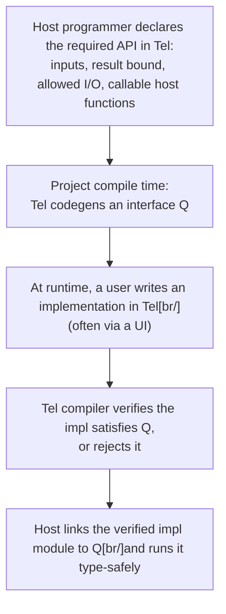

# Embedding Tel in a Host Application

TODO: review

Embedding is the whole point of Tel: a host program runs Tel, never the other
way around (see [`../02-philosophy/02-maxims.md`](../02-philosophy/02-maxims.md)).
This page describes the **host boundary** — what crosses it, in which
direction, and how the two sides agree on a contract.

## The host owns everything outside the script

A Tel script supplies *behaviour*. The host supplies everything else: the
runtime, the data, the I/O, the OS, the process lifecycle. Concretely, the
host decides and exposes:

- **Operations** the script may call — host functions for I/O, lookups,
  domain actions.
- **Types** the script may receive and construct — the host's data model, as
  far as it chooses to share it.
- **Capabilities** — gated powers (filesystem, clock, network, randomness);
  see [`../02-philosophy/03-features.md`](../02-philosophy/03-features.md).

A script can only touch what the host hands it. Anything not exposed does not
exist as far as the script is concerned. This is what makes every embedded Tel
script sandboxed by default.

## Only immutable types cross the boundary

Values that cross the host boundary — in either direction — must be
**immutable**. Mutable types crossing the API boundary are a deliberate
non-feature, because they are genuinely confusing: two languages with two
memory models and (under Tel's per-fiber heaps) two notions of who may touch a
value cannot share a mutable object without surprising one side or the other.

Consequences:

- **Host → script.** The host passes immutable snapshots / value types into
  the script. A script never receives a live mutable host object it could
  change behind the host's back.
- **Script → host.** A script returns immutable values. The host is free to
  copy them into its own mutable structures afterward.
- **Tel does not accept mutable arguments from the host.** Even if a host
  *could* hand in something mutable, Tel rejects it at the boundary. Tel can
  only enforce that *Tel code* does not mutate a value; it cannot police what
  arbitrary host code does, so the safe boundary rule is "immutable only."

```tel
# An interface the host generated for a scripting hook.
# Inputs and result are immutable value types.
fn price(order: Order, market: MarketSnapshot) -> EuroAmt { ... }
```

TODO(open): how an *immutable* view is presented when the host's native type is
mutable — a deep copy at the boundary, a frozen wrapper, or a host-side
contract — is unresolved and interacts with the per-fiber-heap deep-copy rule
in [`../12-memory-and-runtime/03-memory-management.md`](../12-memory-and-runtime/03-memory-management.md).

## Opaque host handles

<!-- TODO: review -->

Plain immutable data is one way to cross the boundary; **opaque host handles**
are the other. A handle is a value whose internals the script cannot see — it
has no fields to read and no constructor to call. The host registers a *type
name* together with a set of operations on it, and the script may only hold
values of that type, pass them around, and call the registered operations.

```tel
# The host registers an opaque type and the trait(s) it satisfies.
opaque type DbConn   # supplied by the host

trait Query {
    fn run(self, sql: Text) -> Rows
}

# To the script, `DbConn` is "a value that implements Query" — nothing more.
fn report(conn: DbConn) -> Rows {
    conn.run("select 1")
}
```

The operations the host attaches to a handle are expressed as **Tel traits**
the handle implements. From the script's side a handle is "a value that
implements `Query` and nothing else nameable" — the same shape as an opaque
type exposed by a Tel module
([Modules](../11-modules-and-packages/01-modules.md#module-level-apis)). The
mechanism is the same; the only difference is where the type is defined.

### Why this is consistent with the immutable rule

The immutable-boundary rule above forbids *shared mutable values*: things with
fields the script can read or write, where script and host can disagree about
who changed what. A handle has neither. The script has **no operations on a
handle except the ones the host registered**, and those operations are host
code. From the script's perspective the handle is an unanalysable token;
whether the host mutates state behind it is invisible and irrelevant. The
two-memory-models hazard does not apply because nothing the script sees lives
in both memories.

The sharper rule is:

- **Plain data values** cross by immutable copy / snapshot.
- **Opaque handles** cross by reference, *and the script can only act on them
  through host-registered operations expressed as Tel traits.*

### Defaults and constraints

- **No construction in Tel.** A script cannot synthesise a value of an opaque
  host type. It can only receive one (as an argument, as a return from a host
  call) and pass it on.
- **No structural exposure.** An opaque host type has no fields, no pattern,
  no `==` unless the host provides one via a trait. Identity and equality are
  host-defined.
- **Task-affinity by default.** An opaque host handle is **task-affine**
  unless the host binding marks it shareable — see
  [the concurrency memory model](../14-concurrency-and-parallelism/07-memory-model-for-concurrency.md).
  Most host handles (DB connections, file descriptors, GPU contexts,
  game-entity references) are unsafe to use from multiple tasks at once; the
  safe default forbids it.
- **Capability gating.** A trait *is* the capability — granting the trait to a
  script grants its operations. There is no separate "may call `Query.run`"
  grant alongside the handle; if the script has the trait in scope, it can
  call it (subject to the project's
  [capability rules](../02-philosophy/03-features.md)).

### Lifetime and multiplicity

An opaque host type picks a multiplicity like any other Tel type. The host
declares whether the handle is:

- **Unrestricted** (`Alias` + `Discard`) — like an immutable value, can be
  passed and dropped at will (e.g. a small numeric ID, a config snapshot
  reference).
- **Affine** (`Discard` only) — may be used at most once / dropped without
  ceremony, but not duplicated (e.g. an entity reference scoped to one frame).
- **Relevant** (`Alias` only) — may be duplicated, but every copy *must* be
  released (e.g. a cloneable sender onto a host channel that should close when
  the last sender leaves).
- **Linear** (neither) — single owner *and must* be consumed by an explicit
  operation; dropping it is a compile error (e.g. a DB connection that must be
  `close`d, a transaction that must be `commit`ed or `abort`ed).

Lifecycle is then enforced by the standard substructural rules
(see [Substructural Types](../12-memory-and-runtime/08-substructural-types.md)):
a host handle is simply a **linear** type — it derives neither `Alias` nor
`Discard`, so it has one owner and must be used. There is no special "host
handle" close mechanism: a `close` operation is just the handle's consuming
"use" method (optionally with an `AutoUse` for end-of-scope), and the type
system rejects code that forgets to call it.

A handle may still become invalid behind the script's back — the underlying
resource is closed by the host, the task that owned it ended, the host
revoked it. Calling a trait method on an invalid handle is a
[recoverable error](../13-error-handling/), not undefined behaviour; the host
declares what failure looks like (typically a result type on every operation).

The multiplicity story above maps directly onto the affine × relevant axes:
a single-owner-must-close handle is **linear**; a single-owner-may-leak handle
is **affine** (`Discard`); a shareable-but-must-release handle (e.g. a cloneable
sender onto a host channel) is **relevant** (`Alias`); a freely-copyable
plain-data handle is **unrestricted**. See
[Substructural Types](../12-memory-and-runtime/08-substructural-types.md).

## Two module APIs at the boundary

The host boundary is not one interface but **two**, facing opposite ways:

1. **What the host expects of the script.** The shape the script's
   implementation must satisfy: which function(s) it must provide, their
   parameter and result types, which capabilities it is allowed to use.
2. **What the script may call on the host.** The operations and types the host
   offers *to* the script — host functions, exposed types, granted
   capabilities.

These are distinct contracts and should be documented and checked separately. A
script implementer reads (1) to know what to write and (2) to know what tools
they have.

How the second API reaches the script is an open design point. The candidates:
an **injected argument** (a host-context object passed in, possibly
with a Kotlin-style receiver so calls read naturally), or an **effect /
capability** the function declares. Both fit Tel's no-ambient-I/O rule — the
script receives its powers, it does not have them.

```tel
# (2) host API reaches the script as an injected context argument
fn handle(msg: Message, host: HostApi) -> Result[Reply, Reject] {
    let now = host.clock.now()
    host.log.info("handling", msg.id)
    ...
}
```

TODO(open): pick the mechanism for surfacing the host-facing API — injected
argument vs effect/capability. The related opaque-types question (does the
host need to register types the script can hold but not inspect?) is now
answered above in [Opaque host handles](#opaque-host-handles); whether
*capabilities* still need a module-level construct rather than per-function
declarations is still open.

### Wiring many capabilities ergonomically

Tel has a fair number of capabilities and effects — `panic`, randomness,
locale, time, the various I/O families. Threading every one through every
function by hand would be a real ergonomics tax, so the wiring should scale to
the *kind* of program, with each kind trading explicitness for convenience
differently:

- **Scripts** want most capabilities in scope with no ceremony. The
  intended shape is the host running the user's code inside a closure that
  already captures the full capability bundle, so a short script reads as if
  the capabilities were ambient — without actually being ambient (the closure,
  not the language, holds them).
- **Binaries** wrap the granted capabilities into a single **context object**
  and pass that one value everywhere, rather than a long parameter list. The
  application author decides the bundle once at `main` and threads the context.
- **Libraries** stay **fine-grained and explicit**: a library declares exactly
  the capabilities it needs and no more, because a bundled "everything" context
  would defeat the point of capability-gating for its callers.

`TODO(open): the exact form of the script "capture-all" closure and the binary
context object — how the bundle is named and constructed, and whether the same
type underlies all three so a library's fine-grained needs are a structural
subset of a binary's context.`

TODO(open): **Should an embedding-entrypoint function be its own declared
form?** Like `test fn` (in [`../14-testing/01-testing.md`](../14-testing/01-testing.md))
or a `main`-style declaration, an `entry fn` (or similar) would be the only
shape the host is allowed to call across the boundary. The benefits would be
(1) the compiler can enforce extra restrictions on its signature — for
example, parameters and return types must be either immutable plain data,
opaque host handles, or one of the host-supplied capability types, never
bare closures or types the host cannot construct; (2) the codegen workflow
above has a single, unambiguous shape to hook into; (3) it documents intent
at the source. The cost is a new declaration form readers have to learn,
and the question of how strict the convertibility-to-primitives rule should
be — too strict and it disallows useful record types, too loose and it
re-opens the boundary hazards [the immutable-types section](#only-immutable-types-cross-the-boundary)
already closes. Decide before pinning the codegen workflow.

## The codegen / verify workflow

A common embedding workflow — for a configurable calculation model, a config
website, a tool like Apivolve — has the host and the script author meet through
a generated interface:



The key properties:

- The **required API is itself written in Tel** — the host programmer
  describes "inputs X and Y, the result must implement Z, I/O is allowed, host
  functions A and B may be called." Nothing host-language-specific is needed
  to state the contract.
- The interface `Q` is **generated ahead of time**, once, at the host
  project's compile time.
- A user-supplied implementation is **verified against `Q` by the Tel
  compiler** before it ever runs. An impl that does not satisfy `Q` — wrong
  signature, uses a capability it was not granted — is rejected.
- Because `Q` was generated statically and the impl was verified against it,
  the host can link and run the impl **type-safely**, even though the impl
  itself arrived at runtime.

This lets a host accept untrusted, runtime-authored scripts while keeping the
same static guarantees it would have for code written in advance.

## Host functions, blocking, and thread-safety

Host-exposed operations are ordinary host code, and Tel cannot see inside them.
Three hazards deserve a clear policy:

- A host function may do **blocking I/O**.
- A host function may do I/O while called from a CPU-bound context.
- A host function may simply **not be thread-safe**.

Tel's concurrency model (tasks, not threads; per-fiber heaps; no script-visible
shared mutable state — see
[`../14-concurrency-and-parallelism/`](../14-concurrency-and-parallelism/02-tasks.md))
shields the *script* from data races in *Tel* values, but it cannot make an
unsafe host function safe.

The likely answer is **classification at the boundary**: when the host
registers an operation, it declares properties Tel can schedule around — for
example "this operation can block" (so the runtime keeps it off a latency-
sensitive task) or "this operation is not safe to call concurrently" (so the
runtime serialises it). This is the host-boundary analogue of marking
functions as "can block."

TODO(open): the exact set of host-function annotations (can-block,
not-thread-safe, does-I/O) and how the Tel runtime uses them — and what
happens if a host *mis*-declares one — is unresolved. This is also a
philosophy-chapter gap: the concurrency model assumes Tel-side data-race
freedom but does not yet say how mis-behaving host functions are contained.

## Bugs the boundary discipline prevents

A few representative catalogue cases
that drive the "immutable values only, classify host functions explicitly"
shape:

- **"Hazelcast routing changed when we added headers to keys."** A
  distributed map routed based on the byte representation of keys; adding
  a header to keys changed the bytes; data ended up routed to a different
  node. Identity-carrying host values that cross the boundary must have
  an *explicit* stable representation; refined types and schema-versioned
  serialization keep the bytes deterministic and reviewable.
- **"Serialization issue between sim and service that local dev didn't
  see."** Embedded mode skipped serialization; production didn't. The
  embedding contract should encourage *always serializing across the
  boundary* in tests, even when the runtime could short-circuit it, so
  serialization bugs surface in dev.
- **"`shared_ptr` returned, dropped, atomic decrement was 26% of
  runtime."** A returned `shared_ptr` was used briefly and discarded;
  the compiler couldn't elide the atomic ref-count operations. The Tel
  rule that the host receives immutable *values* (not host-managed
  smart pointers it then has to refcount through the boundary) avoids
  this entire class of overhead — the value comes across once, the
  host owns its copy.
- **"`ClassNotFound` because runtime dep was removed when a module was
  split."** Service discovery used `ClassIndex.getAnnotated`; a
  runtime-only dep was dropped because the compile didn't notice. Tel
  prefers *no runtime reflection* (see
  [antifeatures](../02-philosophy/04-antifeatures.md)); a similar
  feature in Tel resolves at compile time and breaks the build, not
  service discovery in production.
- **"Cookies invalid because one config field was missing."** A
  configuration with a missing required field silently used a default
  that produced unusable cookies; everything 500'd in a way only
  debugger inspection could explain. The host-API contract should
  reject a missing required field at startup — a refined-type
  constraint at the boundary, not a default at runtime.

## See also

- [Calling Conventions and ABI](02-calling-conventions-and-abi.md) — why the
  boundary is source-level, not ABI-level, and how interpreted vs compiled
  crossing differs.
- [Binding Other Languages](03-binding-other-languages.md) — running one
  script across many host languages.
- [`../02-philosophy/03-features.md`](../02-philosophy/03-features.md) —
  capability-based I/O.
- [`../12-memory-and-runtime/03-memory-management.md`](../12-memory-and-runtime/03-memory-management.md)
  — per-fiber heaps and the deep-copy rule for crossing values.
- [`../11-modules-and-packages/01-modules.md`](../11-modules-and-packages/01-modules.md#module-level-apis)
  — opaque types in Tel modules; the same mechanism underlies opaque host
  handles.
- [`../14-concurrency-and-parallelism/07-memory-model-for-concurrency.md`](../14-concurrency-and-parallelism/07-memory-model-for-concurrency.md)
  — task-affinity rule for opaque host handles.
