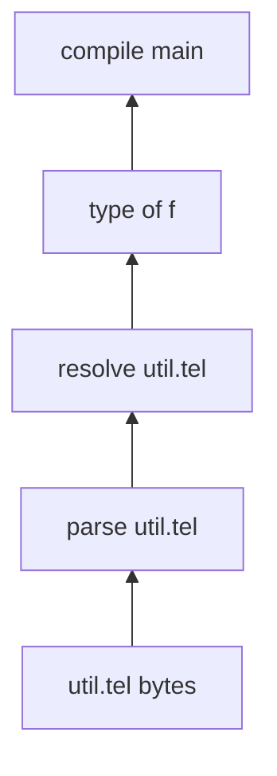

# Compiler Internals: Overview

<!-- TODO: review -->

The rest of this book describes *what* Tel is. This chapter describes *how a
Tel compiler is meant to work inside* — specifically, the incremental query
engine that makes recompilation cheap.

It is here because [compile speed is a language-design goal](../18-tooling/01-compiler.md),
not an implementation detail. Tel is embedded: a host application often
compiles scripts at load time, sometimes on every run, and an editor
recompiles on every keystroke. A compiler that is only fast on a cold build
fails the use case. So the caching model is part of the design, and a reader
who wants to *implement* Tel needs it.

## What

The compiler is a **query engine**, not a pipeline of passes over a whole
program. Every unit of work — "parse file F", "resolve F", "type of function
G", "code for G at `i64`" — is a **query**: a pure function from its inputs to
an answer. Queries call other queries; those calls are recorded as dependency
edges; answers are cached and reused.

The three properties that follow, and that the rest of the chapter builds:

- **Correct reuse.** A cached answer is served only when its transitive inputs
  are unchanged — and that check is not a separate bookkeeping system that can
  drift out of sync, it is a property of the cache key.
- **Early cutoff.** A change that does not change an answer stops propagating
  there. Reformatting a file re-parses it and then costs nothing else.
- **Sharing.** Cache entries are portable. The same entry is valid across runs,
  across processes, and across machines, with no invalidation protocol between
  them.

Edges point from a dependency up to the query that consulted it — the
direction invalidation travels.

## Why not just cache results

The obvious design — memoize each step by its logical name ("parse of
`util.tel`") — is correct only while inputs are immutable. Once a source file
can change, a memo keyed by name serves stale answers: the memo is asked "parse
of `util.tel`" and cheerfully returns yesterday's AST. Tracking dependencies
does not by itself fix this; a dependency graph that is never consulted at
lookup time is a debugging aid, not a cache protocol.

The two repairs that suggest themselves both have a fatal flaw on their own:

- **Timestamp validation** — store the file's mtime with the answer, re-check
  on hit. It misses the transitive case entirely (a changed file invalidates
  its own parse, but nothing above it), and it misses on the most common cheap
  win: `git checkout` rewrites mtimes even when bytes are identical.
- **Eager invalidation only** — on change, delete every dependent's cache
  entry. Correct, but it throws away work that a later edit could reuse, and it
  cannot express "this answer did not actually change".

Tel's answer is to make the cache key *be* the validity check. See
[Keys and Fingerprints](03-keys-and-fingerprints.md).

## The two edits that define success

Correctness is table stakes. Whether the cache is *useful* is decided by two
everyday editing patterns, and they need different mechanisms.

### Revert and branch-switch

> Compile; add a line; compile; delete the line; compile again. Or switch git
> branches back and forth.

This must be a hit. It is a hit **iff keys are derived from content**, not from
timestamps or revision counters: restoring identical bytes restores an
identical key, and the intermediate version simply lived under a different key.
Nothing needs to detect "which cached answer is the right one" — the key
answers that by construction.

The cost is that every compile still reads and hashes the changed files, to
know which key to look up. What is saved is the *computation*, not the read.

### A whitespace edit deep in a leaf

> Add a blank line, or reformat, in a widely-imported file.

The file genuinely changed, so it must re-parse — unavoidable. But if the
resulting AST is identical, nothing above it should run.

This does **not** fall out of content-addressing; naive content-addressing
defeats it. New bytes give a new parse key, and if dependents key on their
*inputs' source*, every key above changes and the whole tree rebuilds. Cutting
the cascade requires comparing **outputs**: re-run parse, observe that the
answer is unchanged, and let dependents key on the *answer* rather than on the
source that produced it. That is what result fingerprints are for.

Tel's AST helps here: it is span-free in fast mode (source locations live in a
side table), so a whitespace edit really does produce an equal AST. Compilers
whose AST nodes embed spans cannot get this cutoff, because every node below an
inserted line shifts.

> `TODO(open):` any node that embeds a source location *as data* (a panic site,
> an assertion message) re-introduces the problem for its enclosing function.
> Either such strings must be span-free in fast mode, or the cutoff is lost for
> functions that contain them. Decide when the diagnostics format is pinned.

## How the chapter is organised

| Topic | What it covers |
|---|---|
| [The query graph](02-query-graph.md) | queries, context-mediated dependencies, forward and reverse edges, phase ordering |
| [Keys and fingerprints](03-keys-and-fingerprints.md) | the three identifiers and the two cache layers |
| [Invalidation](04-invalidation.md) | pull from the root, push from the leafs, early cutoff |
| [Hashing](05-hashing.md) | which hash, which width, and why the widths differ |
| [Deterministic hashing](06-deterministic-hashing.md) | keeping key inputs stable across runs and machines |
| [Execution and recovery](07-execution-and-recovery.md) | concurrency, cancellation, failures, lost events |
| [Cycle detection](08-cycle-detection.md) | catching import cycles before they deadlock |
| [Invariants](09-invariants.md) | the rules the whole design rests on |
| [Why content-addressed](10-content-addressing-rationale.md) | the long-form comparison against verifying traces |

A working prototype of this engine lives in the repository under `sandbox/` — a
minimal Lisp-like language built solely to exercise the query engine against a
real compiler shape. Notes on its current state are in `sandbox/plans/`, and
scratch implementation thinking is in [`../impl-notes/`](../impl-notes/README.md);
neither is part of this documentation.
