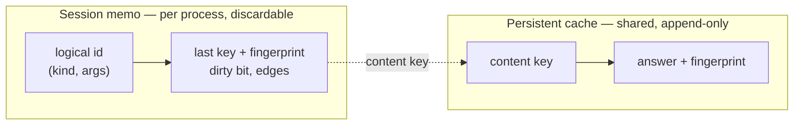
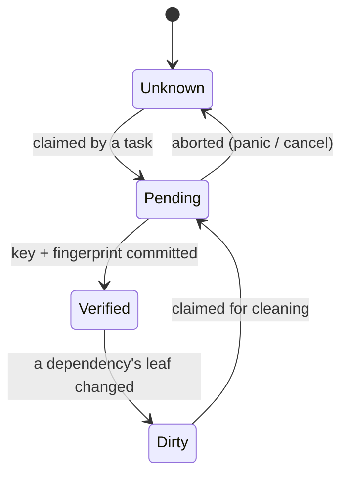

# Keys and Fingerprints

<!-- TODO: review -->

This is the data model of the cache: what identifies a query, what identifies
its answer, and which of the two layers each piece lives in. The recomputation
algorithms that run on top of it are in [Invalidation](04-invalidation.md).

## Three identifiers

Every query has three identifiers, and conflating any two of them breaks
something:

| | What | Width / form | Job |
|---|---|---|---|
| **Logical id** | `(kind, args)` — "type of `X`" | process-local, internable to a small integer | the persistent *identity* of a query across time and edits |
| **Content key** | `hash(kind, stable args, dependencies' result fingerprints)` | 128-bit | lookup key into the persistent cache; portable across runs and machines |
| **Result fingerprint** | `hash(direct output)` | 64-bit | ingredient of dependents' content keys; enables early cutoff |

### Logical id

`(kind, args)` — "parse file F", "type of X". This is how a query is *named*,
and the name does not change when file contents change. Everything
session-scoped hangs off it: the memo of the last known content key and result
fingerprint, dirty bits, and both directions of dependency edge.

It is process-local and may freely use interned indices, because it never
leaves the process. A leaf's logical id is its file path; that its *content*
changes is exactly the point.

### Content key

```text
key = hash128(kind, stable form of args, result fingerprint of each direct dependency)
```

Four properties matter:

- **Transitive by recursion, one hop at a time.** The key contains only
  *direct* dependencies' fingerprints — and those were themselves computed
  downstream of *their* dependencies. This is a Merkle DAG over **answers**,
  not over raw inputs. Folding transitive raw input into the key would make
  every key in the project change on any whitespace edit, destroying early
  cutoff.
- **Leaf keys hash the external input itself** — the source byte digest. This
  is the only place external state enters the system.
- **Portable.** Built exclusively from data with a stable encoding (see
  [Deterministic hashing](06-deterministic-hashing.md)), so the same key means
  the same computation on any machine. This is what makes the cache shareable.
- **128 bits**, because a content key identifies a value among *all values ever
  seen* — birthday territory. See [Hashing](05-hashing.md).

### Result fingerprint

`hash64(direct output)` — and only the direct output. Since steps are
deterministic, the output is a pure function of the content key, so there is
nothing transitive left to add: anything tempting is already reachable through
the dependency fingerprints inside the key.

64 bits suffices because of *where* fingerprints get compared. A collision only
matters between two fingerprints that could occupy the **same dependency slot
of the same dependent** — that is, among the historical outputs of one logical
query. That domain is bounded by the number of edits to that query over the
project's lifetime, not by the size of the cache. It holds only while
fingerprints are never used as storage keys — [invariant 2](09-invariants.md).

## Two layers

| Layer | Keyed by | Contains | Lifetime |
|---|---|---|---|
| **Session memo** (in memory) | logical id | last content key, last result fingerprint, forward + reverse edges, node state | one process; rebuildable from scratch |
| **Persistent cache** (disk, possibly shared) | content key | the answer, plus its result fingerprint | across runs and machines; append + GC only |

The split is the core of the design, and keeping the two from contaminating
each other is most of the discipline it demands.

**The persistent cache is never invalidated.** An entry under a content key is
valid forever by construction — if any input had changed, the key would be
different. Superseded entries are garbage, not hazards; reclaim them with GC or
LRU on whatever schedule suits. Any urge to "invalidate" a persistent entry
means a determinism bug is being papered over; fix the input capture instead.

**All dirtiness lives in the session layer.** Dirty bits, edges, node states,
and every piece of "what changed" reasoning are process-local and discardable.
Delete the memo and correctness is untouched — the next compile re-derives
every key from the root.



### Cutoff runs on fingerprints, not on values

Early cutoff propagates on result *fingerprints*, which live in the memo. A
step's *value* lives only in the persistent store. The two have independent
lifetimes, and that has a useful consequence: **a garbage-collected
intermediate value can never block a cutoff.**

In a chain `A → B → C`, if C's output is unchanged, B rebuilds an unchanged
content key from C's *memoized* fingerprint and reports its own unchanged
fingerprint up to A — without B's value being present in the store at all.

A value is fetched only when some dependent must actually *execute*. If it was
reclaimed, that is an ordinary store miss: recompute, and determinism
guarantees the recompute reproduces the identical fingerprint, so nothing
upstream is disturbed. The only thing that must survive for B to count as clean
is B's fingerprint in the memo — lose that and B is simply unknown and gets
re-pulled, never falsely clean.

## Node states

A memo entry moves through four states:



- **Unknown** — nothing memoized; must be pulled.
- **Dirty** — memoized, but a leaf below it changed; the memo may be stale and
  must be re-verified before use. Conservative: it very often verifies
  unchanged.
- **Pending(owner, wakers)** — a task has claimed this query and is computing
  it. Later arrivals wait rather than duplicating the work.
- **Verified(key, fingerprint)** — memo is current for this generation.

Cleaning a `Dirty` node happens under the same claim as computing an `Unknown`
one, so leaf-driven mode is not a separate build mode — it is the same pull,
over a memo that happens to carry dirty flags.
